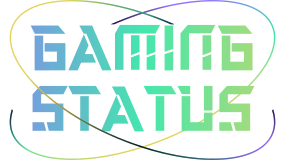

   

   Projeto desenvolvido para consolidar os conhecimentos de ReactJS estudados

   Feito Por
    <a href="https://github.com/FelipeTorress"> Felipe Torres.
    <h1></h1>
  

## Tecnologias ⚙️

- [Typescript](https://www.typescriptlang.org/)
- [React](https://reactjs.org/)
- [React Native](https://reactnative.dev)
- [Tailwindcss](https://tailwindcss.com)
- [Node](https://nodejs.org/en/)
- [Vite](https://vitejs.dev)

## Fluxo Aplicação Web 🖥️
- Pesquisar Players

  

- Cadastrar um anuncio para Duo (faltando implementação para flex e demais dados de contato do usuário como Instagram e whatsapp)

  

## To Do 📝

- Terminar funcionalidade de Duos implementando para times Flex
- Implementar as mesmas funcionalidades do League of Legends com os demais jogos
- Implementar versão Mobile

## Atenções ❗❗
- A key da API do lol tem duração de um dia, logo é necessário ficar atualizando ela no arquivo ".env" do server
- A interface tomou como base o projeot nlw-Esports da RocketSeat (https://www.figma.com/file/eQvcANpV8msFSJfQShA8hs/NLW-eSports-(Community)) porem a ideia foi incrementada, no entanto não finalizada.
